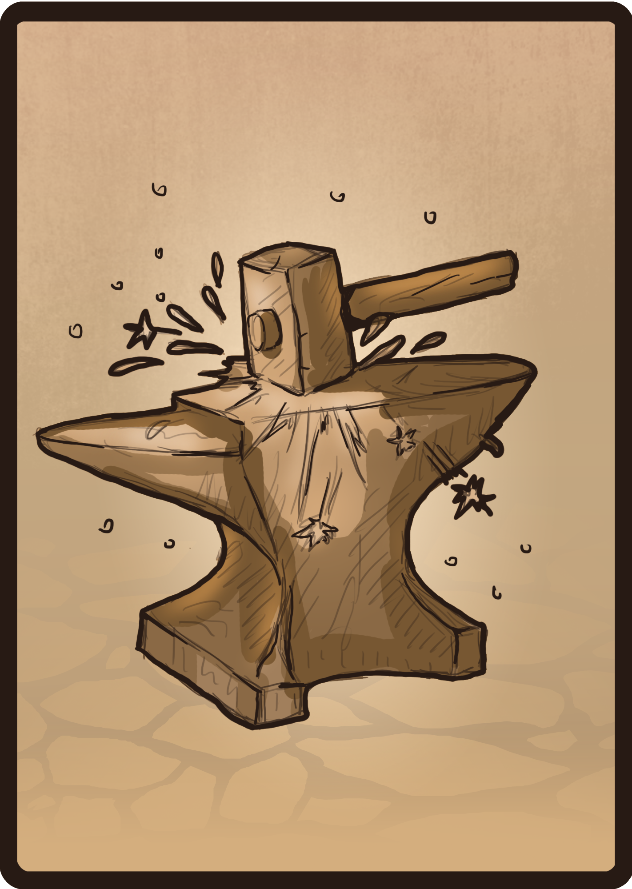

<!--
  Github Repository Template (https://github.com/APrettyCoolProgram/dotfiles-templates-and-gists-etc)
  Version: Version 20.7.200729.1200
  Authors: development@aprettycoolprogram.com
  Additional documentation: /AppResource/Doc/Proj/
-->

<h2 align="center">
  
   
  A collection of various stuff
   
</h2>

<h2 align="center">

  

</h2>

<table>
<tr>
<td img src="repodata/img/spacer.png" alt="blank-spacer" width="800" height="1">

  ### CONTENTS
  [**ABOUT**](#about-crispydeven) 
  [**TEMPLATES**](#templates) 
  [**EXTENSIONS**](#extensions) 
  [**FONTS**](#fonts) 
  [**THEMES**](#themes) 

</td>
</tr>
</table>

# ABOUT
**Dotfiles & Gists, Etc.** is a collection of various configuration files, code snippits, and useful extensions.

# TEMPLATES
Various templates
* [GitHub repository](https://github.com/APrettyCoolProgram/dotfiles-templates-and-gists-etc/tree/master/template/github/repository)
* [Visual Studio .NET Core WPF application](https://github.com/APrettyCoolProgram/dotfiles-templates-and-gists-etc/tree/development/template/visual-studio/csharp/dotnet-core-csharp-wpf-template)

# EXTENSIONS

# FONTS

# THEMES

***

&nbsp;&nbsp;&nbsp;&nbsp;&nbsp;
 
&nbsp;&nbsp;

<!-- LOGO AND SHORT BLURB [Required] ----------------------------------------------------------------------------------
Display a logo and give a short description what the repository is. Keep the description short, and save the details
for the introduction. The repository name is optional; sometimes it looks good, sometimes it doesn't. Increase/decrease
the logo size by increasing/decreasing the "width" value.
----------------------------------------------------------------------------- (Remove this comment block when done) -->
<h2 align="center">
  Dotfiles and Gists, Etc.
   
  A collection of dotfiles, random experiments, and other (useful?) things
   
   
</h2>

# ABOUT THIS REPOSITORY

## DOTFILES
### GitHub
* [**generic.gitignore**](https://github.com/APrettyCoolProgram/dotfiles-and-gists-etc/blob/development/dotfiles/github/generic.gitignore)
#### Visual Studio
* [**License Header Manager license header**](https://github.com/APrettyCoolProgram/dotfiles-and-gists-etc/blob/development/dotfiles/visual-studio-2019/license-header-manager.licenseheader)
* [**Visual Studio 2019 .editorconfig (C#)**](https://github.com/APrettyCoolProgram/dotfiles-and-gists-etc/blob/development/dotfiles/visual-studio-2019/visual-studio-2019-csharp.editorconfig)
* [**Visual Studio 2019 .vssettings**](https://github.com/aprettycoolprogram/dotfiles-and-gists-etc/blob/development/dotfiles/visual-studio-2019/visual-studio-2019.vssettings)
* [**Viasfora settings**](https://github.com/APrettyCoolProgram/dotfiles-and-gists-etc/blob/development/dotfiles/visual-studio-2019/viasfora-settings.xml)
* [**Viasfora theme**](https://github.com/APrettyCoolProgram/dotfiles-and-gists-etc/blob/development/dotfiles/visual-studio-2019/viasfora-theme.json)

## EXTENSIONS
### Visual Studio
* [**Productivity Power Tools**](https://marketplace.visualstudio.com/items?itemName=VisualStudioPlatformTeam.ProductivityPowerPack2017)
  * Align Assignments
  * Copy As Html
  * Double-Click Maximize
  * Fix Mixed Tabs
  * Match Margin
  * Middle-Click Scroll
  * Peek Help
  * Power Commands for Visual Studio
  * Quick Launch Tasks
  * Shrink Empty Lines
  * Solution Error Visualizer
  * Time Stamp Margin
* [**Web Essentials 2019**](https://marketplace.visualstudio.com/items?itemName=MadsKristensen.WebEssentials2019&ssr=false)
  * Add New File
  * Browser Reload on Save
  * Browser Sync
  * Bundler & Minifier
  * CSS Tools 2019
  * Editor Enhancements
  * File Icons
  * File Nesting
  * Image Sprites
  * Image Optimizer
  * Markdown Editor
  * Open Command Line
  * Package Installer
  * Package Security Alerts
  * SVG Viewer [Preview]
  * Web Accessibility Checker
  * Web Compiler
  * ZenCoding
* [**.ignore**](https://marketplace.visualstudio.com/items?itemName=MadsKristensen.ignore)
* [**Automatic Versions 2**](https://marketplace.visualstudio.com/items?itemName=PrecisionInfinity.AutomaticVersions)
* [**Code Alignment**](https://marketplace.visualstudio.com/items?itemName=cpmcgrath.Codealignment)
* [**Color Theme Designer**](https://marketplace.visualstudio.com/items?itemName=ms-madsk.ColorThemeDesigner)
* [**Color Themes for Visual Studio**](https://marketplace.visualstudio.com/items?itemName=VisualStudioPlatformTeam.ColorThemesforVisualStudio)
* [**Comment Remover**](https://marketplace.visualstudio.com/items?itemName=MadsKristensen.CommentRemover)
* [**Dummy Text Generator**](https://marketplace.visualstudio.com/items?itemName=MadsKristensen.DummyTextGenerator)
* [**Editor Guidelines**](https://marketplace.visualstudio.com/items?itemName=PaulHarrington.EditorGuidelines)
* [**License Header Manager**](https://marketplace.visualstudio.com/items?itemName=StefanWenig.LicenseHeaderManager)
* [**Open in Notepad++**](https://marketplace.visualstudio.com/items?itemName=CalvinAAllen.OpeninNotepad)
* [**Open in Visual Studio Code**](https://marketplace.visualstudio.com/items?itemName=MadsKristensen.OpeninVisualStudioCode)
* [**Pretty Paste**](https://marketplace.visualstudio.com/items?itemName=MadsKristensen.PrettyPaste)
* [**SlowCheetah**](https://marketplace.visualstudio.com/items?itemName=vscps.SlowCheetah-XMLTransforms)
* [**Trailing Whitespace Visualizer**](https://marketplace.visualstudio.com/items?itemName=MadsKristensen.TrailingWhitespaceVisualizer)
* [**Viasfora**](https://marketplace.visualstudio.com/items?itemName=TomasRestrepo.Viasfora)
* [**Visual Studio Spell Checker**](https://marketplace.visualstudio.com/items?itemName=EWoodruff.VisualStudioSpellCheckerVS2017andLater)
* [**VSColorOutput**](https://marketplace.visualstudio.com/items?itemName=MikeWard-AnnArbor.VSColorOutput)
* [**XAMLStyler**](https://marketplace.visualstudio.com/items?itemName=TeamXavalon.XAMLStyler)

## FONTS
* [**Fira Code**](https://github.com/tonsky/FiraCode)
* [**Google Fonts**](https://github.com/google/fonts)

## NUGET PACKAGES
### Visual Studio
* [**Roslyn Analyzers**](https://github.com/dotnet/roslyn-analyzers)
* [**Roslynator**](https://github.com/JosefPihrt/Roslynator)

## TEMPLATES
### GitHub
* [**Standard repository**](https://github.com/APrettyCoolProgram/DotfilesAndGistsEtc/tree/master/Templates/GitHubRepository)

### Visual Studio Project Templates
* [**C# .NET Core Class Library Project**](https://github.com/APrettyCoolProgram/dotfiles-and-gists-etc/tree/development/template/visual-studio-2019/CSharpNETCoreClassLibrary)
* [**C# .NET Core Console Project**](https://github.com/APrettyCoolProgram/dotfiles-and-gists-etc/tree/development/template/visual-studio-2019/CSharpNETCoreClassLibrary)
* [**C# .NET Core WPF Project**](https://github.com/APrettyCoolProgram/dotfiles-and-gists-etc/tree/development/template/visual-studio-2019/CSharpNETCoreWPF)
* [**C# .NET Core xUnit Project**](https://github.com/APrettyCoolProgram/dotfiles-and-gists-etc/tree/development/template/visual-studio-2019/CSharpNETCoreXUnit)

Notepad++
* editorconfig plugin https://github.com/editorconfig/editorconfig-notepad-plus-plus

## THEMES
* [**Dracula**](https://draculatheme.com/)

***

  &nbsp;
  &nbsp;
  &nbsp;
  &nbsp;
  &nbsp;

Dotfiles, Templates & Gists (Etc.) is a collection of various configuration files, code snippits, project templates, useful extensions, etc that I've created and collected over the years.