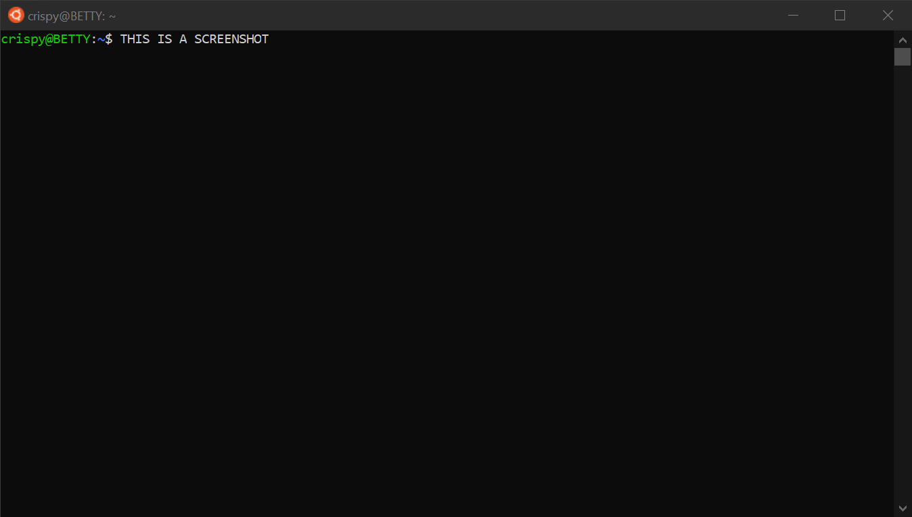

<!--
  Github Repository Template (https://github.com/APrettyCoolProgram/dotfiles-templates-and-gists-etc)
  Version: Version 20.7.200728.1200
  Authors: development@aprettycoolprogram.com
  Additional documentation: /AppResource/Doc/Proj/
-->

<!--

***
### THIS REPOSITORY HAS BEEN ARCHIVED
*this-repository* is no longer being developed, and this repository has been archived.

Development has been moved to [*new-repository*](https://github.com/github-account/new-repository).
***

-->

<h2 align="center">
  
   
  GitHub Repository Template
   
</h2>

<h2 align="center">

  
  
  

</h2>

<h1 align="center">
  
   
</h1>

<h6 align="center">

  [CHANGELOG](repodata/doc/changelog.md)&nbsp;&bull;&nbsp;[ROADMAP](repodata/doc/roadmap.md)&nbsp;&bull;&nbsp;[KNOWN ISSUES](doc/development/known-issues.md)&nbsp;&bull;&nbsp;[WEBSITE](URL)&nbsp;&bull;&nbsp;[BLOG](URL)&nbsp;&bull;&nbsp;[DEMO](URL)&nbsp;&bull;&nbsp;[MANUAL](URL)
   

</h6>

<!-- The HTML indentations have to stay this way to work. -->
<table>
<tr>
<td img src="repodata/img/spacer.png" alt="blank-spacer" width="800" height="1">

  ### CONTENTS
  [**ABOUT**](#about-crispydeven) 
  [**GETTING STARTED**](#getting-started) 
  &nbsp;&nbsp;&nbsp;&nbsp;[Before you begin](#before-you-begin) 
  &nbsp;&nbsp;&nbsp;&nbsp;[Prerequisites](#prerequisites) 
  [**INSTALLING**](#installing) 
  &nbsp;&nbsp;&nbsp;&nbsp;[Before installing](#before-installing) 
  &nbsp;&nbsp;&nbsp;&nbsp;[Windows](#windows) 
  &nbsp;&nbsp;&nbsp;&nbsp;[MacOS](#macos) 
  &nbsp;&nbsp;&nbsp;&nbsp;[Linux](#linux) 
  &nbsp;&nbsp;&nbsp;&nbsp;[Other operating systems](#other-operating-systems) 
  [**SETUP**](#setup) 
  &nbsp;&nbsp;&nbsp;&nbsp;[Configuring](#configuring) 
  [**USAGE**](#usage) 
  &nbsp;&nbsp;&nbsp;&nbsp;[Updating](#updating) 
  &nbsp;&nbsp;&nbsp;&nbsp;[Uninstalling](#uninstalling) 
  [**COMPILING**](#compiling) 
  &nbsp;&nbsp;&nbsp;&nbsp;[Making](#making) 
  &nbsp;&nbsp;&nbsp;&nbsp;[Building](#building) 
  &nbsp;&nbsp;&nbsp;&nbsp;[Deploying](#deploying) 
  [**TESTING**](#testing) 
  [**API**](#api) 
  [**ADDITIONAL INFORMATION**](#additional-information) 
  &nbsp;&nbsp;&nbsp;&nbsp;[Philosophy](#philosphy) 
  &nbsp;&nbsp;&nbsp;&nbsp;[How it works](#how-it-works) 
  &nbsp;&nbsp;&nbsp;&nbsp;[FAQ](#faq) 
  &nbsp;&nbsp;&nbsp;&nbsp;[Built with](#built-with) 
  &nbsp;&nbsp;&nbsp;&nbsp;[Used by](#used-by) 
  &nbsp;&nbsp;&nbsp;&nbsp;[Acknowledgements](#acknowledgements) 
  &nbsp;&nbsp;&nbsp;&nbsp;[Support](#support) 
  [**PROJECT**](#project) 
  [**DEVELOPMENT**](#development) 

</td>
</tr>
</table>

# ABOUT
This is a template for GitHub repositories.
### Features
* Feature #1
* Feature #2
* Feature #3

# GETTING STARTED
### Before you begin
Things you should do before you begin.
### Prerequisites
* Prerequisite #1
* Prerequisite #2
* Prerequisite #3
### Additional notes
Additional notes can go here.

# INSTALLING
### Windows
1. The steps to install the project in Windows
2. Use both Markdown and/or HTML
3. Include screenshots when possible.
### MacOS
1. The steps to install the project in MacOS
2. Use both Markdown and/or HTML
3. Include screenshots when possible.
### Linux
1. The steps to install the project in Linux
2. Use both Markdown and/or HTML
3. Include screenshots when possible.
### Other operating systems
1. The steps to install the project in other operating systems
2. Use both Markdown and/or HTML
3. Include screenshots when possible.
4. If other operating systems are not supported, mention that here.

# SETUP
If your project has a setup procedure, document it here. For example, you may need to make changes to a configuration file before using the project.
### Configuring
Configuration introduction.
#### Required configuration settings
Required configuration settings go here.
#### Recommended configuration settings
Recommended configuration settings go here.
#### Optional configuration settings
Optional configuration settings go here.
### Important notes about options
Optional/important notes about options go here.

# USING
Usage instructions go here.

# UPDATING
Updating instructions go here

# UNINSTALLING
Optional/important notes about usage go here.

# COMPILING
Optional/important notes about usage go here.
### Making
Making instructions go here.
### Building
Building instructions go here.
### Deploying
Deployment instructions go here.

# TESTING
Here.

# HOW IT WORKS
Sometimes it's fun to let users know how the magic happens.

# API
If your project contains an API, it should be documented here (or link to the documentation).

# FAQ
### Are you nice?
I think so.

# DEVELOPMENT
### CONTRIBUTORS
* [Contributor #1](URL/Email)
* [Contributor #2](URL/Email)
* [Contributor #3](URL/Email)
### ACKNOWLEDGEMENTS
* [Acknowledgements](repodata/doc/acknowledgements.md)
* [Third-party notices](repodata/doc/roadmap.md)
### CONTRIBUTING
If you are interested in contributing to this project, please see our:
* [Code of conduct](doc/repository/code-of-conduct.md)
* [Contributing guidelines](doc/repository/contributing.md)
* [Testing procedures](doc/repository/testing.md)
* [Issue template](doc/repository/issue-template.md)
* [Pull request template](doc/repository/pull-request-template.md)
### PROJECT FILES
* [Development notes](repodata/doc/development-notes.md)

# ADDITIONAL INFORMATION
### RELATED PROJECTS
* [Related project #1](URL)
* [Related project #2](URL)
* [Related project #3](URL)
### BUILT WITH
* [Built with #1](URL)
* [Built with #2](URL)
* [Built with #3](URL)
### ADDITIONAL READING
* [Additional reading #1](URL)
* [Additional reading #2](URL)
* [Additional reading #3](URL)

***

&nbsp;&nbsp;&nbsp;&nbsp;&nbsp;
 
&nbsp;&nbsp;