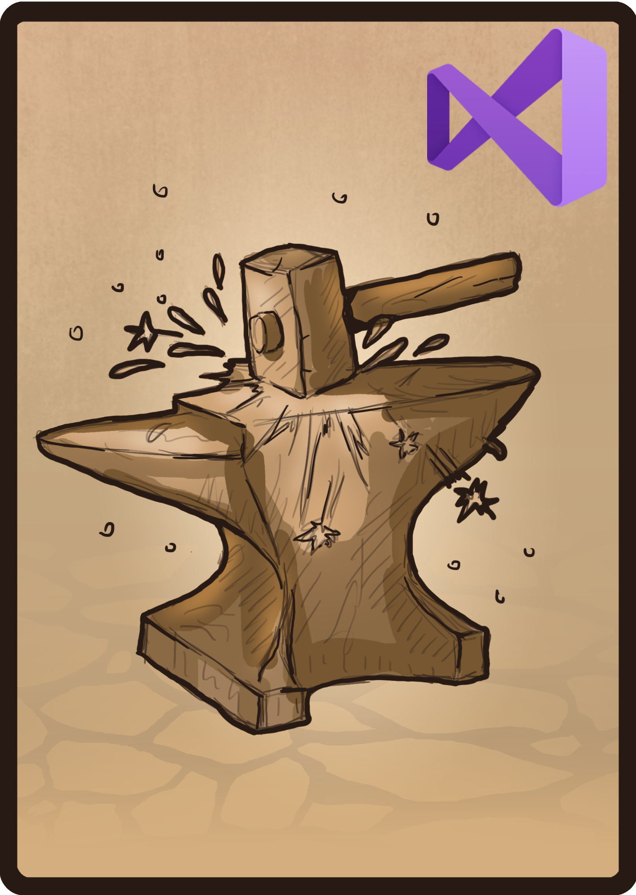

<h2 align="center">
  
  <br>
  A C# .NET Core WPF project template for Visual Studio 2019
  <br>
</h2>

<h2 align="center">

  
  [](https://www.apache.org/licenses/LICENSE-2.0)
  

</h2>

# USAGE
To use this project template in Visual Studio 2019:
1. Download the [dotnet-core-csharp-wpf-template](template/visual-studio/csharp/dotnet-core-csharp-wpf-template/export/dotnet-core-csharp-wpf-template.zip)
2. Copy that file to `%USERPROFILE%\Documents\Visual Studio 2019\Templates\ProjectTemplates\Visual C#\`

The next time you start Visual Studio 2019, the project template will be available to use.

# Creating dotnet-core-csharp-wpf-template
These are the steps to that I used to create the [project template](template/visual-studio/csharp/dotnet-core-csharp-wpf-template/src)

### Create a new project
1. Create a new WPF App (.NET Core) project.
2. Name it "dotnet-core-csharp-wpf-template".

### If you are using the [License Header Manager](https://marketplace.visualstudio.com/items?itemName=StefanWenig.LicenseHeaderManager) extension, add a "sourcecode.licenseheader" file
1. Add the file to the project root.
2. The contents of the file should be:
```
extensions: .html .xaml
<!--
	Game Asset Studio (https://github.com/CalistadalaneGames/game-asset-studio)
	<file-name> (bMMDD.HHMM): <file-description>
	Authors:
	 calistadalane@aprettycoolprogram.com
	 development@aprettycoolprogram.com
	Additional documentation: /AppResource/Doc/Proj/
-->

extensions: designer.cs generated.cs
extensions: .cs
// Game Asset Studio (https://github.com/CalistadalaneGames/game-asset-studio)
// <file-name> (bMMDD.HHMM): <file-description>
// Authors:
//	calistadalane@aprettycoolprogram.com
//	development@aprettycoolprogram.com
// Additional documentation: /AppResource/Doc/Proj/

extensions: .md
> [Game Asset Studio](https://github.com/CalistadalaneGames/game-asset-studio)<br>
> <file-name>: <file-description>
> Additional documentation: /AppResource/Doc/Proj/

```
3. Save the "sourcecode.licenseheader" file.

### Make modifications to the MainWindow.xaml file
1. Add a license header. If you are using the [License Header Manager](https://marketplace.visualstudio.com/items?itemName=StefanWenig.LicenseHeaderManager) extension, **right click on the file name** and choose **License Headers > Add License Header**.
2. If you are using the [XAML Styler](https://marketplace.visualstudio.com/items?itemName=TeamXavalon.XAMLStyler) extension, right click the XAML code and choose "Format XAML".

### Make modifications to the MainWindow.xaml.cs file
1. Add a license header. If you are using the [License Header Manager](https://marketplace.visualstudio.com/items?itemName=StefanWenig.LicenseHeaderManager) extension, **right click on the file name** and choose **License Headers > Add License Header**.
2. Run Code Cleanup.

### Change the Output path
1. Right-click on the **dotnet_core_csharp_wpf_template** project
2. Click **Properties**
3. Under **Build > Output**, change the "Output path" to "../build"
4. Click **Save**

### Add the following NuGet packages:
1. Microsoft.CodeAnalysis.FxCopAnalysers
2. Roslynator.Analysers

### Export the .editorconfig file
Go to **Tools > Options > Code Style**

### Change the version number
1. Open the .csproj file and change the version to **0.0.0.0**
2. Save